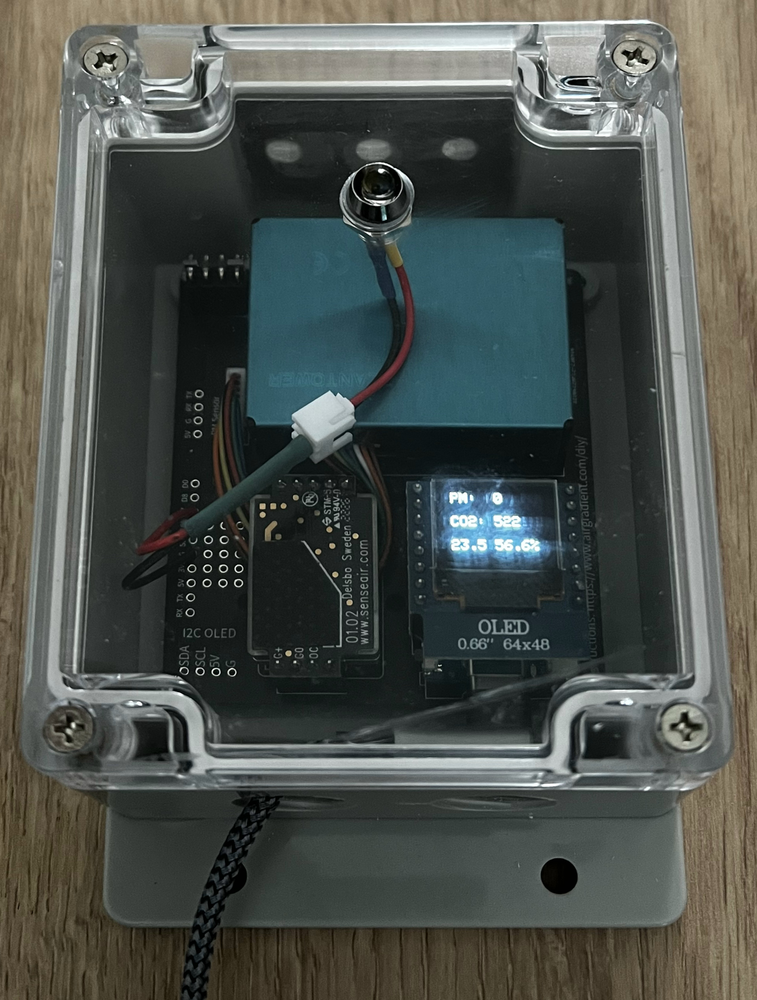

# AirGradient Basic/DIY - Prometheus

Like many others, I mostly work from home, spending several hours in a small spare room of my house. In my location, it is very uncommon to air condition your home, and for much of the year it is too cold to keep a window open for long periods of time. I was interested to see what impact air quality had on my mental performance and measure the affect of different ventilation approaches. Additionally, having woodworking as a hobby means that I'm also concerned about the amount of fine particulate matter that I inadvertently may be breathing in, even after any visible wood dust has dissipated.

Inspired by [Jeff Geerling's air quality monitoring setup](https://www.jeffgeerling.com/blog/2021/airgradient-diy-air-quality-monitor-co2-pm25), and being a sucker for DIY and soldering, I decided to invest in a couple of [AirGradient's DIY air sensors](https://www.airgradient.com/diy/). However, much like Jeff, I'd prefer not to send my data to AirGradient indefinitely, and would like to scrape that data locally using Prometheus and visualise it using Grafana.

This repository describes that process. It borrows heavily from [Jeff's own repository](https://github.com/geerlingguy/airgradient-prometheus), of which this is a fork. However, when trying to follow his approach directly, the code refused to compile. I suspect because the AirGradient Arduino Library that Jeff uses is now outdated. Jeff used 2.4.15 but 3.1.3 is the latest at time of writing, and it seems that the [move from v2 to v3](https://forum.airgradient.com/t/new-airgradient-arduino-library-version-3/1639) has, as expected, removed some backwards compatibility. Therefore, this repository also borrows heavily from the [official AirGradient BASIC example Arduino code](https://github.com/airgradienthq/arduino/tree/master/examples/BASIC).

In addition, this project aims to add a few enhanced features.

- Turn off the display during night time hours to extend its life. Air quality measurement and the Prometheus server remain active even when the screen is off.
- Add a LED which blinks when PM2.5, CO2, temperature, or relative humidity levels go above a configurable threshold. This is to act as a visual queue to take some action to improve the air quality.
- Add an offset adjustment to the temperature sensor. Due to the proximity of the temperature and humidity module to other components on the PCB, it can be affected by surrounding heat, usually causing it to read a few degrees higher than the true air temperature. This configurable offset allows for a correction to be made depending on your own setup.
- Improved documentation on the setup process.
- Slightly more robust error checking and failovers if the device disconnects or a sensor does not provide a valid reading.

## Build Guide

See [the detailed build guide for both hardware and software](./docs/guide.md).
