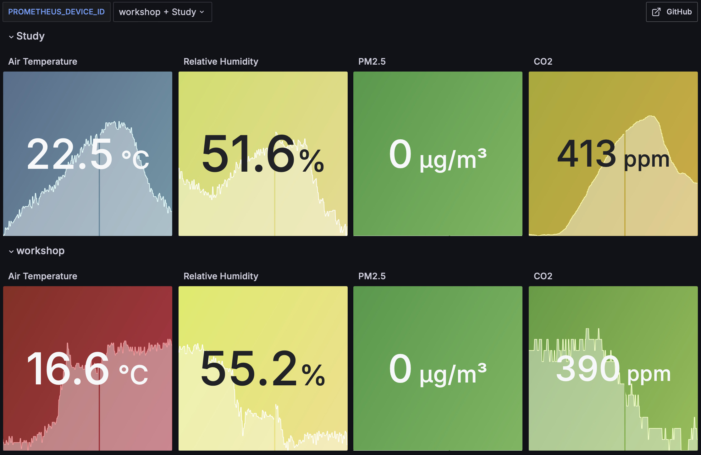

# Guide

## Hardware

The [hardware guide](./hardware.md) will instruct you through the initial assembly of the AirGradient DIY Basic kit, enclosure, and installation of the warning LED. If you follow all steps in the guide, you should end up with a sensor looking like the picture above. Of course, the addition of a case and warning LED is optional.

## Software

The [software guide](./software.md) will instruct you through flashing the WEMOS LOLIN D1 Mini, configuring the software to your preferences and calibrating the sensor to your location and setup. It will also guide you through the configuration needed on Prometheus and Grafana to get a dashboard set up to record and display air quality metrics over time.
